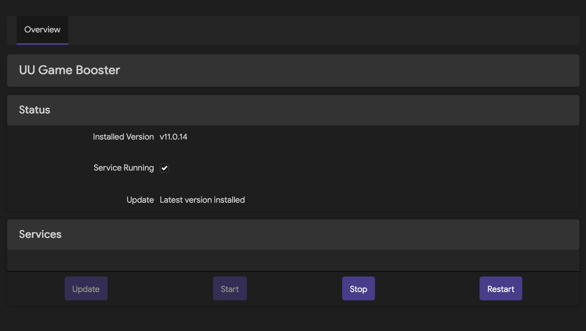

# Installation Guide

## ⚠️ Testing Status

**Current Testing Status**: OpenWRT 24.10.1 (x86_64 only)

This project has been tested and confirmed to work on OpenWRT 24.10.1. Other versions may require adaptation. If you encounter issues on different OpenWRT versions, please [open an Issue](https://github.com/LASER-Yi/uu-booster/issues) with:
- Your OpenWRT version (`cat /etc/openwrt_release`)
- Router model and architecture
- Detailed error messages or logs
- Steps to reproduce the problem

## Prerequisites

- OpenWRT 21.03 or higher (tested on 24.10.1)
- Root access to your router
- Internet connection for downloading the UU binary
- Approximately 5MB free space
- kmod-tun kernel module

## Installation Methods

### Method 1: From GitHub Releases (Recommended)

**Step 1: Download the package**

Visit the [GitHub Releases](https://github.com/LASER-Yi/uu-booster/releases) page and download the latest packages:
- `uu-booster_*.ipk` - Core package (required)
- `luci-app-uu-booster_*.ipk` - Optional web interface

**Step 2: Transfer to router**

Use SCP or WinSCP to transfer the packages to your router:

```bash
# Example using scp
scp uu-booster_*.ipk root@192.168.1.1:/tmp/
scp luci-app-uu-booster_*.ipk root@192.168.1.1:/tmp/
```

**Step 3: Install the packages**

SSH into your router and install:

```bash
ssh root@192.168.1.1

# Install core package (required)
opkg install /tmp/uu-booster_*.ipk

# Install web interface (optional, for LuCI management)
opkg install /tmp/luci-app-uu-booster_*.ipk
```

### Method 2: LuCI Web Interface

**Step 1: Download packages**

Download both packages from [GitHub Releases](https://github.com/LASER-Yi/uu-booster/releases):
- `uu-booster_*.ipk`
- `luci-app-uu-booster_*.ipk`

**Step 2: Upload and install via LuCI**

1. Log in to your OpenWRT router's LuCI web interface
2. Navigate to "System" → "Software"
3. Click "Upload package"
4. Select `uu-booster_*.ipk` and upload
5. Click "Install"
6. Repeat for `luci-app-uu-booster_*.ipk`



### Method 2: Build from Source

For advanced users who want to build from source, see [BUILD_GUIDE](../developer/BUILD_GUIDE.md) for detailed build instructions.

## Architecture Support

The package automatically detects your router's architecture during installation.

| OpenWRT Architecture | Example Devices | API Parameter |
|----------------------|-----------------|---------------|
| aarch64_*            | Raspberry Pi 4, Rockchip boards, ARM64 routers | openwrt-aarch64 |
| arm_*                | Raspberry Pi 2/3, various ARMv7 boards | openwrt-arm |
| mipsel_*             | MT7620/7621, MediaTek routers | openwrt-mipsel |
| x86_64               | x86 routers, PCs running OpenWRT | openwrt-x86_64 |

To check your router's architecture before installation:

```bash
cat /etc/openwrt_release | grep DISTRIB_ARCH
```

## What Happens During Installation

When you install the package, it automatically performs these steps:

1. **Detects Architecture** - Reads `/etc/openwrt_release` to determine your router's architecture
2. **Queries UU API** - Contacts NetEase's API to get the correct binary download URL and MD5 checksum
3. **Downloads Binary** - Downloads the UU plugin binary with MD5 validation
4. **Validates Download** - Verifies the downloaded file matches the expected MD5 checksum
5. **Configures Firewall** - Sets up necessary firewall rules for the plugin via UCI defaults
6. **Starts Service** - Enables and starts the uu-booster service

The installation process will output progress and any errors encountered.

## Verifying Installation

After installation, verify everything is working correctly:

```bash
# Check if service is running
/etc/init.d/uu-booster status

# Check if binary is present and executable
ls -la /usr/sbin/uu/uuplugin

# Check if config file exists
cat /usr/sbin/uu/uu.conf

# Check if device UUID exists
ls -la /usr/sbin/uu/.uuplugin_uuid

# View service logs
logread | grep uu-booster
```

## Post-Installation Configuration

The package includes automatic firewall configuration via UCI defaults. After installation:

1. The firewall rules are automatically applied
2. The service starts automatically
3. You can manage the plugin using the `uu` command

See [USAGE.md](USAGE.md) for more information on managing the plugin.

### Firewall Rules

The following firewall rules are automatically created:

- UU zone with masquerading enabled
- Forwarding rules from LAN to UU
- Forwarding rules from UU to LAN

To verify firewall rules:

```bash
uci show firewall.uu
iptables -L -n | grep uu
```

## Uninstallation

To remove the package and all its components:

```bash
# Remove the package
opkg remove uu-booster
```

The removal script will automatically:
- Stop the uu-booster service
- Remove the binary directory (`/usr/sbin/uu`)
- Remove firewall rules
- Preserve the device UUID in `/etc/uu/.uuplugin_uuid` for future reinstalls

### Complete Removal

If you want to completely remove all UU Booster files:

```bash
# After package removal, manually remove preserved files
rm -rf /etc/uu/.uuplugin_uuid
```

## Common Installation Issues

### Download Fails

**Symptoms:**
```
Downloading and installing UU Booster binary...
Failed to download from primary URL
```

**Solutions:**

1. Check internet connectivity:
   ```bash
   ping -c 3 router.uu.163.com
   ```

2. Verify API is accessible:
   ```bash
   curl http://router.uu.163.com/api/plugin?type=openwrt-x86_64
   ```

3. Check disk space:
   ```bash
   df -h
   ```
   Ensure at least 5MB free space is available.

4. Review logs:
   ```bash
   logread | grep uu-booster
   ```

5. Manual retry:
   ```bash
   /usr/bin/uu update
   ```

### Architecture Detection Fails

**Symptoms:**
```
Unknown architecture: xyz123
```

**Solutions:**

1. Check your architecture manually:
   ```bash
   cat /etc/openwrt_release | grep DISTRIB_ARCH
   ```

2. Verify supported architectures:
   - aarch64_*
   - arm_*
   - mipsel_*
   - x86_64

3. If your architecture is not supported, please [open an Issue](https://github.com/LASER-Yi/uu-booster/issues) with:
   - Your architecture string
   - Router model
   - CPU information: `cat /proc/cpuinfo`

### MD5 Checksum Mismatch

**Symptoms:**
```
MD5 checksum mismatch: expected xxx..., got yyy...
```

**Solutions:**

1. Wait and retry:
   ```bash
   /usr/bin/uu update
   ```

2. Check available disk space:
   ```bash
   df -h /tmp
   ```
   Ensure sufficient space for download.

3. Verify network stability:
   ```bash
   ping -c 10 router.uu.163.com
   ```

4. If problem persists, [open an Issue](https://github.com/LASER-Yi/uu-booster/issues) with error details.

### Permission Denied Errors

**Symptoms:**
```
mkdir: cannot create directory '/usr/sbin/uu': Permission denied
```

**Solutions:**

1. Ensure running as root:
   ```bash
   whoami
   # Should output: root
   ```

2. Check directory permissions:
   ```bash
   ls -la /usr/sbin/
   ```

3. Manually create directory if needed:
   ```bash
   mkdir -p /usr/sbin/uu
   chmod 755 /usr/sbin/uu
   ```

### Service Won't Start

**Symptoms:**
```
/etc/init.d/uu-booster start
Starting uu-booster... failed
```

**Solutions:**

1. Check if binary exists:
   ```bash
   ls -la /usr/sbin/uu/uuplugin
   ```

2. Check if binary is executable:
   ```bash
   file /usr/sbin/uu/uuplugin
   chmod +x /usr/sbin/uu/uuplugin
   ```

3. Check if kmod-tun is loaded:
   ```bash
   lsmod | grep tun
   # If not loaded:
   insmod tun
   ```

4. Check configuration file:
   ```bash
   cat /usr/sbin/uu/uu.conf
   ```

5. Check service status:
   ```bash
   /etc/init.d/uu-booster status
   ```

6. View detailed logs:
   ```bash
   logread | grep uu-booster
   ```

7. Try starting manually:
   ```bash
   /usr/sbin/uu/uuplugin /usr/sbin/uu/uu.conf
   ```

## Getting Help

If you encounter any issues not covered here:

1. Check the [Troubleshooting Guide](TROUBLESHOOTING.md)
2. [Open an Issue on GitHub](https://github.com/LASER-Yi/uu-booster/issues) with:
   - Your OpenWRT version: `cat /etc/openwrt_release`
   - Router model and architecture
   - Complete error messages or logs: `logread | grep uu-booster > /tmp/error.log`
   - Steps to reproduce the problem
   - Any relevant screenshots
